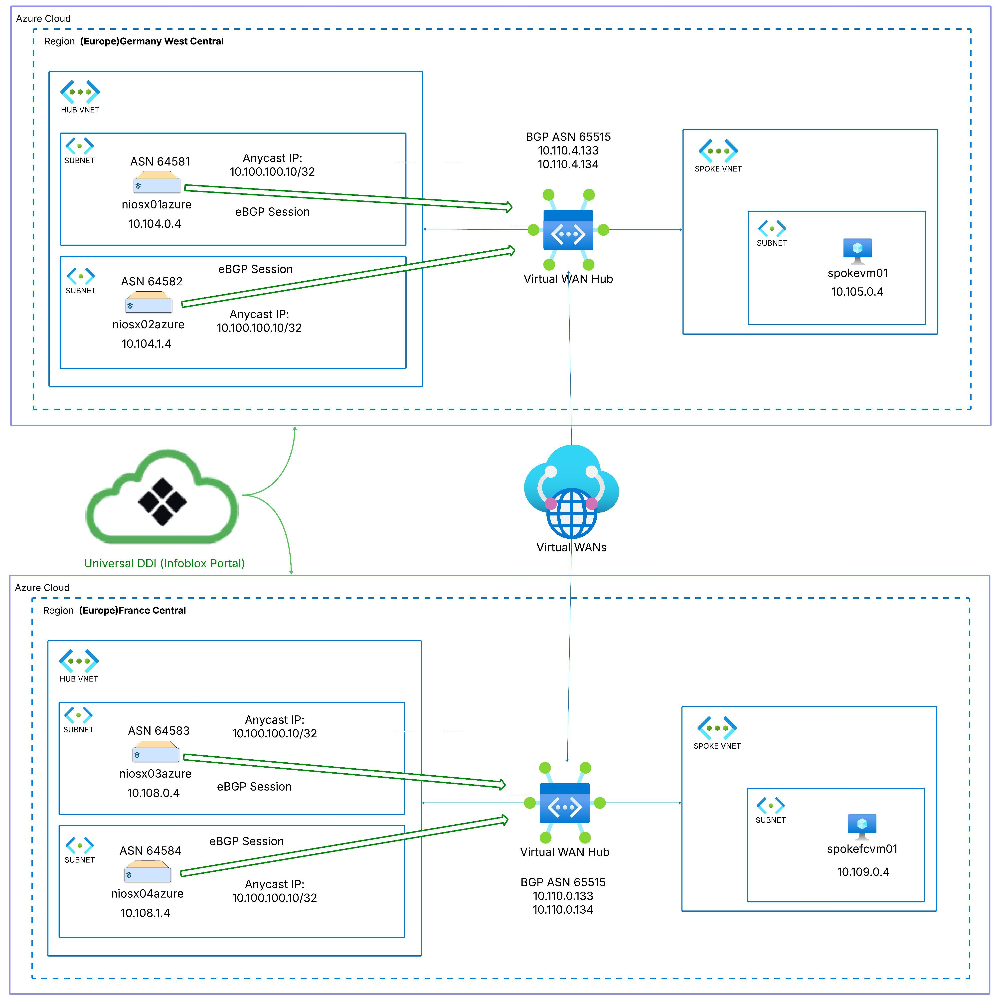

# Infoblox UDDI and Azure Virtual WAN Terraform Lab

This Terraform lab automates deployment of a multi-region Anycast DNS architecture using Infoblox NIOS-X appliances integrated with Azure Virtual WAN (vWAN).
It mirrors the Infoblox reference lab demonstrating how to build a scalable, resilient DNS fabric with BGP Anycast across multiple Azure regions.

Note:
Terraform automates only the Azure infrastructure (Virtual WAN, hubs, VNets, connections, route tables, and BGP peering).
NIOS-X appliances (DNS, Anycast IP, and BGP configuration) must still be configured manually after deployment.

## Overview

The deployment builds the following environment:

- Creates a global Azure Virtual WAN and regional hubs 
- Builds shared and spoke VNets per region 
- Connects VNets to hubs with custom route tables
- Configures BGP peers toward NIOS-X appliances
- Supports optional automated NIOS-X VM deployment (Marketplace image) 
- Securely injects the Infoblox join token during deployment

The result is a fully functional Anycast DNS topology using the Anycast IP `10.100.100.10/32`, advertised from NIOS-X appliances in both regions over BGP to Azure Virtual WAN hubs.  
All spokes resolve DNS through the Anycast IP, achieving cross-region resiliency and low latency.

## Architecture



| Region                 | Hub CIDR      | NIOS-X ASN | NIOS-X IPs            | Anycast Prefix      |
|------------------------|--------------|-----------|------------------------|---------------------|
| Germany West Central   | 10.110.0.0/22 | 64581 / 64582 | 10.104.0.4 / 10.104.1.4 | 10.100.100.10/32 |
| France Central         | 10.110.4.0/22 | 64583 / 64584 | 10.108.0.4 / 10.108.1.4 | 10.100.100.10/32 |

## Repository Structure

```text
.
├── docs/
│   └── azure-vwan-anycast-architecture.jpeg
├── modules/
│   ├── hub-bgp/
│   │   └── main.tf
│   ├── hub-connections/
│   │   └── main.tf
│   ├── niosx-vm/
│   │   ├── cloud-init.tpl
│   │   └── main.tf
│   ├── vnet/
│   │   └── main.tf
│   └── vwan/
│       └── main.tf
└── terraform/
    ├── main.tf
    ├── outputs.tf
    ├── providers.tf
    ├── terraform.tfvars
    ├── variables.tf
    └── versions.tf

```

## Prerequisites

- Terraform v1.5 or later  
- Azure CLI authenticated (`az login`)  
- Contributor permissions on the target subscription  
- Optional: Infoblox NIOS-X image available in your Azure Marketplace subscriptions

## Security and Secrets

Join token input: Terraform prompts for the Infoblox join token at runtime.
It is not written to disk, not committed to git, and not stored in state.

.gitignore: The repository should include entries for:

```text

terraform/.terraform/
terraform/*.tfstate
terraform/*.tfstate.*
terraform/.terraform.lock.hcl
terraform/terraform.tfvars

```

Never commit any file containing your join token, SSH keys, or credentials.

## Variables

The key variables are defined in `terraform.tfvars`:

```hcl
subscription_id = "<your-azure-subscription-id>"
prefix          = "iblox-azure-anycast"
anycast_prefix  = "10.100.100.10/32"

# Regional configuration
locations = {
  gwc = {
    rg_name  = "rg_hub_gwc_01"
    location = "germanywestcentral"
    hub = {
      name         = "hub_gwc_01"
      address_cidr = "10.110.0.0/22"
      asn          = 65515
    }
    vnet_shared = {
      name   = "vnet_shared_gwc"
      cidr   = "10.104.0.0/16"
      subnets = {
        niosx = "10.104.0.0/24"
        mgmt  = "10.104.1.0/24"
      }
    }
    vnet_spoke = {
      name   = "vnet_spoke_gwc"
      cidr   = "10.114.0.0/16"
      subnets = {
        vm = "10.114.0.0/24"
      }
    }
    niosx_bgp_peers = [
      { name = "niosx01azure", ip = "10.104.0.4", asn = 64581 },
      { name = "niosx02azure", ip = "10.104.1.4", asn = 64582 },
    ]
  }

  fra = {
    rg_name  = "rg_hub_fc_01"
    location = "francecentral"
    hub = {
      name         = "hub_fc_01"
      address_cidr = "10.110.4.0/22"
      asn          = 65515
    }
    vnet_shared = {
      name   = "vnet_shared_fc"
      cidr   = "10.108.0.0/16"
      subnets = {
        niosx = "10.108.0.0/24"
        mgmt  = "10.108.1.0/24"
      }
    }
    vnet_spoke = {
      name   = "vnet_spoke_fc"
      cidr   = "10.118.0.0/16"
      subnets = {
        vm = "10.118.0.0/24"
      }
    }
    niosx_bgp_peers = [
      { name = "niosx03azure", ip = "10.108.0.4", asn = 64583 },
      { name = "niosx04azure", ip = "10.108.1.4", asn = 64584 },
    ]
  }
}

deploy_niosx_vms = true

niosx_image = {
  publisher = "infobloxinc"
  offer     = "bloxone"
  sku       = "3_3"
  version   = "latest"
}

admin_username = "azureuser"
ssh_public_key = "~/.ssh/id_rsa.pub"

```

# Deployment


```hcl

terraform init
terraform plan

```
When prompted:

```hcl

var.infoblox_join_token
  Infoblox join token for registering NIOS-X with UDDI

  Enter a value: <joint token that you get from UDDI >

```
Then:

```hcl

terraform apply

```

Terraform will deploy the entire topology end-to-end, including VNets, hubs, connections, route tables, and BGP peering.

# Validation

After the Terraform deployment completes:

```text

1. Manually configure the NIOS-X appliances:

   - Enable DNS service on each appliance.
   - Assign the Anycast IP `10.100.100.10/32`.
   - Establish BGP peering with the hub router IPs.
   - Advertise the Anycast prefix.

2. Once NIOS-X starts advertising the prefix, validate in the Azure portal:

   - The Anycast prefix `10.100.100.10/32` appears in **Effective Routes** of both hubs and spoke VNets.
   - BGP peering shows as **Established** under each **Virtual Hub → BGP Connections**.
   - Spoke VMs can ping the Anycast IP and resolve DNS queries through it.

```

Example test from a spoke VM:

```hcl

ping 10.100.100.10
dig @10.100.100.10 infoblox.com +short

```

Cleanup

To destroy the environment:
```hcl

terraform destroy

```

References

```text

Infoblox Universal DDI Documentation: https://docs.infoblox.com/

Azure Virtual WAN BGP Peering : https://learn.microsoft.com/en-us/azure/virtual-wan/scenario-bgp-peering-hub?utm_source=chatgpt.com

Anycast DNS on Azure Blog: (link to your blog post once published)

```